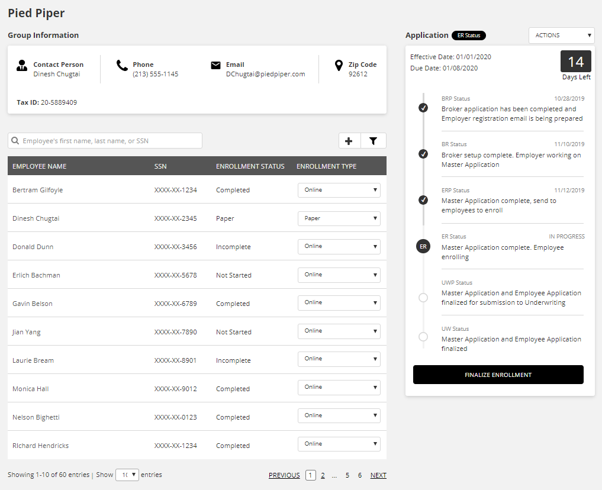

  

<h1 align="center">
  Coding Challenge
</h1>

This webpage was built to satisfy the coding challenge phase of my interview process with Word & Brown.

## Challenge Description

<strong>Code the following webpage. We aren't expecting any interactivity. You may apply a color palette of your choice.</strong>

## Netlify Link

Open me in Chrome :)
